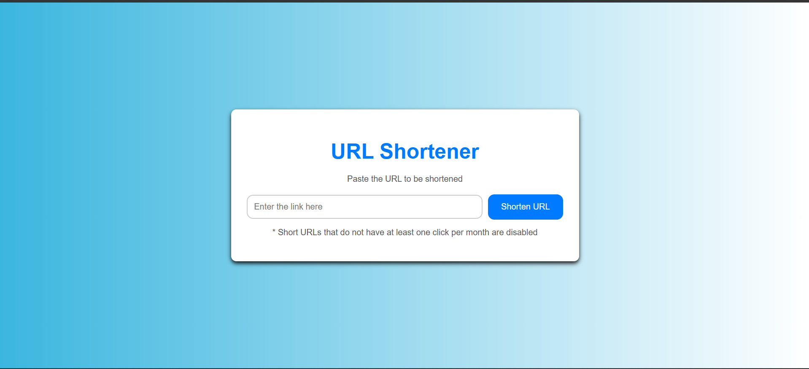

# Short URL Project

A simple and efficient URL shortener built using **Node.js**, **Express**, **MongoDB**, and **Shortid**. The project is deployed on [Render](https://render.com) and is available at [Short URL](https://short-url-m9x0.onrender.com).

## Features

- Generate unique short URLs for any given long URL.
- Redirect to the original URL when the short URL is accessed.
- Clean and modular codebase with separate files for models, routes, and views.
- Integrated with MongoDB for storing URLs.
- Deployed on Render for public access.

## Tech Stack

- **Frontend**: HTML, CSS
- **Backend**: Node.js, Express.js
- **Database**: MongoDB
- **Dependencies**: Shortid, Mongoose
- **Version Control**: Git, GitHub

## Project Structure

```
Short-URL/
├── views/               # EJS templates for the frontend
├── models/              # Mongoose schemas and models
├── routes/              # Express routes
├── connection/          # MongoDB connection logic
├── public/              # Static files (CSS, JS, images)
├── index.js             # Main server entry point
└── package.json         # Dependencies and scripts
```

## Getting Started

### Prerequisites

- Node.js installed
- MongoDB instance running (local or cloud, e.g., MongoDB Atlas)

### Installation

1. Clone the repository:

   ```bash
   git clone https://github.com/AbhishekRDJ/Short-URL.git
   cd Short-URL
   ```

2. Install dependencies:

   ```bash
   npm install
   ```

3. Set up environment variables:

   Create a `.env` file in the root directory and add the following:

   ```env
   PORT=3000
   MONGO_URI=mongodb://<your-mongo-db-uri>
   ```

4. Start the server:

   ```bash
   npm start
   ```

5. Visit the application at `http://localhost:3000`.

## Deployment

This project is deployed on [Render](https://render.com). You can view it live here: [https://short-url-m9x0.onrender.com](https://short-url-m9x0.onrender.com).

To deploy it yourself:

1. Push the project to a GitHub repository.
2. Connect the repository to Render.
3. Configure the environment variables on Render.
4. Deploy the application.

## Usage

1. Enter a long URL in the input field on the homepage.
2. Click the "Shorten" button.
3. Copy and use the generated short URL.
4. Access the short URL to be redirected to the original URL.

## Screenshots



## License

This project is open source and available under the [MIT License](LICENSE).

---

### Connect with Me

- **GitHub**: [AbhishekRDJ](https://github.com/AbhishekRDJ)
- **Deployed Project**: [Short URL](https://short-url-m9x0.onrender.com)
